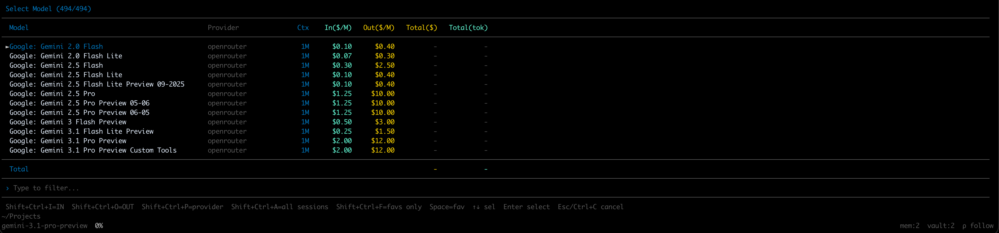

# Pi Model Selector

A Pi coding agent extension that enhances model selection with pricing and cumulative usage information.



## Features

- **`/models` command** — Lists all available models with detailed metrics (leaves built-in `/model` untouched).
- **Pricing Display** — Shows Input and Output price per million tokens (`In($/M)`, `Out($/M)`).
- **Cumulative Usage Tracking** — Parses your actual Pi session logs (`.jsonl`) to show exactly how many tokens you've used and how much it cost you per model (`Total($)`, `Total(tok)`).
- **Scope Toggling** — By default, shows usage for the current session. Press `Shift+Ctrl+A` to toggle and calculate usage across all sessions in the current month.
- **Smart Sorting & Filtering** — 
  - Sort by input price (`Shift+Ctrl+I`)
  - Sort by output price (`Shift+Ctrl+O`)
  - Filter by provider (`Shift+Ctrl+P`)
- **Favorites** — Mark your favorite models with `Space`. Favorites get a star (★) and are always pinned to the top of the list. Press `Shift+Ctrl+F` to filter and show *only* your favorites.
- **Auto-Calculated Costs** — For providers that only report token usage but no costs (like local models or `cursor-agent`), the extension automatically calculates the true cost based on the model's pricing.

## Installation

Place this file in your Pi extensions directory:

```bash
~/.pi/agent/extensions/pi-model-selector.ts
```

Pi will load it automatically on startup.

## Usage

Once installed, use `/models` in any Pi session to browse available models.

**Shortcuts in the UI:**
- `↑↓` — Navigate list
- `Enter` — Select model
- `Esc` or `Ctrl+C` — Cancel
- `Shift+Ctrl+I` — Sort by Input Price
- `Shift+Ctrl+O` — Sort by Output Price
- `Shift+Ctrl+P` — Cycle through Providers
- `Shift+Ctrl+A` — Toggle usage scope (Current Session ↔ All Sessions this Month)
- `Space` — Toggle Favorite status for the selected model
- `Shift+Ctrl+F` — Toggle "Favorites Only" view

## Tech Stack

- TypeScript
- Pi Extension API (`@mariozechner/pi-coding-agent`)
- Pi AI types (`@mariozechner/pi-ai`)
- Pi TUI components (`@mariozechner/pi-tui`)
